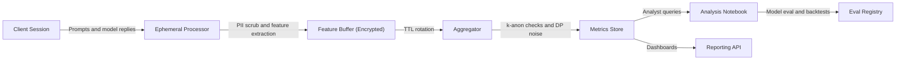

# Interpretive Polling in Objectivity AI™

**A developer-focused design, implementation, and limitations paper**

> Version 1.1.0

---

## Abstract

Traditional opinion polling asks direct questions and records explicit answers. It is useful for measuring declared preferences but often misses the reasoning pathways that produce those preferences. **Interpretive Polling** is an Objectivity AI™ methodology that infers aggregate sentiment, stance, and reasoning patterns from **de-identified, aggregated** interaction telemetry gathered during normal model use. The signal is derived from **how people ask, refine, and react to information**, not only from what they say in a survey.

This paper specifies the concept, data model, privacy controls, system architecture, algorithms, evaluation, governance, and known limitations. It is written to be technically precise and policy-safe. Any data collection described here must comply with your model/provider terms, privacy law, and internal governance. No individual user identification is required or desired.

---

## Table of Contents

* [Scope and Non-Goals](#scope-and-non-goals)
* [Concept Overview](#concept-overview)
* [Data Sources and Privacy Model](#data-sources-and-privacy-model)
* [System Architecture](#system-architecture)
* [Core Features and Metrics](#core-features-and-metrics)
* [Algorithms](#algorithms)
* [Aggregation, Uncertainty, and Calibration](#aggregation-uncertainty-and-calibration)
* [Evaluation and Backtesting](#evaluation-and-backtesting)
* [Adversarial Robustness](#adversarial-robustness)
* [Operational Playbook](#operational-playbook)
* [Pros and Cons](#pros-and-cons)
* [Compliance and Governance](#compliance-and-governance)
* [Implementation Sketch](#implementation-sketch)
* [Data Schemas](#data-schemas)
* [FAQ](#faq)
* [Change Log](#change-log)

---

## Scope and Non-Goals

**In scope**

* Aggregated, de-identified analysis of interaction patterns (prompts, edits, follow-ups, acceptance signals) as statistical features
* Model-agnostic methods for stance detection, sentiment drift, and topic clustering
* Privacy-by-design architecture: minimization, pseudonymization, and differential privacy options
* Comparative validation against conventional polling and ground-truth events

**Out of scope**

* Any collection or use of personally identifiable information (PII)
* Provider-internal data not explicitly permitted by your agreements
* Micro-targeting or user-level prediction
* Claims that interpretive polling “replaces” traditional surveys

---

## Concept Overview

**Interpretive Polling** treats an LLM session as a **reasoning trace**. Instead of asking “Do you support X, yes or no?”, we observe:

1. **Prompt evolution**: how a question is phrased initially, then reframed over time
2. **Response negotiation**: whether the user requests evidence, corrections, or counterpoints
3. **Acceptance behavior**: implicit signals like copy/export, stop-asking, or bookmarking analogs
4. **Sentiment trajectory**: the tonal and stance movement across a conversation chain
5. **Consensus mapping**: patterns that recur across many users on the same theme

We then **aggregate** these features to produce population-level indicators such as stance distribution, confidence, and the **rate of change** of sentiment around a topic.

---

## Data Sources and Privacy Model

### Minimal, de-identified telemetry (recommended)

* **Token/Embedding features**: vectorized representations of prompts and summaries of model replies
* **Thread topology**: message order, reply depth, recursion count, and branch factors
* **Operator signals**: “ask for sources,” “request counterargument,” “ask for plain-English,” etc.
* **Acceptance proxies**: user stops asking on a topic, moves to implementation details, or explicitly marks “sufficient” in UIs that support it
* **Timing**: coarse timestamps bucketed (e.g., hour or day), no raw wall-clock logs exposed downstream

> Do **not** store raw text unless you have lawful basis and you have applied robust PII scrubbing with validated recall/precision. Prefer ephemeral text → features → discard text.

### Anonymization posture

* **No user IDs** in analysis layers. Use per-session random GUIDs that rotate and are unjoinable across time.
* **Aggregation thresholds**: only publish metrics for cohorts ≥ *k* (e.g., k=100) and windows ≥ *t* (e.g., 24h).
* **Differential Privacy (DP)**: add calibrated noise to counts and means for public releases.
* **Data retention**: raw feature buffers TTL (for example 14–30 days), aggregates retained longer.

### Provider and legal constraints

All collection and processing must align with:

* The LLM provider’s developer terms and data-use policies
* Regional privacy law (GDPR, CCPA/CPRA, etc.)
* Your own internal data-governance policies

When in doubt, restrict to **on-device or on-prem feature extraction**, and only emit DP-noised aggregates.

---

## System Architecture



* **Ephemeral Processor**: stripping PII, creating embeddings, computing local features
* **Feature Buffer**: short-lived encrypted store with strict TTL
* **Aggregator**: combines features into cohort metrics, applies k-anonymity and DP
* **Metrics Store**: long-lived, aggregate-only warehouse
* **Reporting API**: serves time-series, distributions, and uncertainty bounds

---

Here’s the **Core Features and Metrics** section rewritten in proper GitHub-friendly Markdown using KaTeX syntax so your equations render cleanly:

---

## Core Features and Metrics

Let a topic cohort be ( \mathcal{C} ) and a time window ( W ).

### **Refinement Depth (RD)**

Average recursive turns per session on a topic:

$$
RD = \frac{1}{|\mathcal{S}|} \sum_{s \in \mathcal{S}} \text{turns}_s
$$


### **Prompt Evolution Distance (PED)**

Mean cosine distance between initial and final prompt embeddings:

$$
PED = \frac{1}{|\mathcal{S}|} \sum_{s \in \mathcal{S}}
\Bigl( 1 - \cos!\bigl(\vec{p}_0, \vec{p}_f\bigr) \Bigr)
$$


### **Evidence Solicitation Rate (ESR)**

Fraction of sessions that request citations, data, or counter-arguments.


### **Acceptance Proxy Rate (APR)**

Fraction of sessions that terminate with “implementation” intents or explicit “resolved”.


### **Sentiment Drift (SD)**

Mean signed change in sentiment score from the first to last segment in a thread:

$$
SD = \frac{1}{|\mathcal{S}|}
\sum_{s \in \mathcal{S}}
\Bigl(\text{sentiment}*{\text{last},s} - \text{sentiment}*{\text{first},s}\Bigr)
$$


### **Stance Distribution (STDIST)**

Soft classification over ({ \text{support}, \text{oppose}, \text{neutral/unclear} }) using a calibrated classifier.
For stance probabilities from logits ( z_k ):

$$
P(y = k \mid \mathbf{z}) =
\frac{e^{z_k}}{\sum_{j} e^{z_j}}
$$


### **Contentiousness Index (CI)**

Variance of stance posteriors within the window; higher values indicate greater disagreement:

$$
CI = \mathrm{Var}!\bigl(\hat{p}_{\text{stance}}\bigr)
$$


### **Volatility (VOL)**

Absolute first difference of key metrics over time (e.g., ( RD, SD, STDIST )):

$$
VOL_t = |m_t - m_{t-1}|
$$


---

## Algorithms

### 1) Topic and Cohort Identification

* **Keyword match + semantic retrieval** to route sessions into topic cohorts
* **HDBSCAN or spectral clustering** on embedding space to surface emergent subtopics
* Manually maintain a **topic ontology** with versioning. Auto-proposals require human acceptance.

### 2) Sentiment and Stance

* **Multi-task classifier** fine-tuned on de-identified supervision sets
* Outputs: sentiment ∈ [−1, 1], stance logits over {support, oppose, neutral}
* Calibrate posteriors with **Platt scaling** or **temperature scaling** on a held-out set

### 3) Prompt Evolution

* Compute **embedding deltas** across the thread
* Extract edit-ops features (e.g., token-level Levenshtein over normalized text if allowed)
* Engineer “seek-evidence”, “steelman”, “devil’s advocate” flags from prompt intents

### 4) Consensus Mapping

* Build **co-occurrence graphs** of subtopics and stances
* Graph community detection → “consensus islands” and “fault lines”
* Track movement of mass between islands over time

### 5) Uncertainty

* For each metric, estimate **bootstrap confidence intervals** over sessions
* For distributions, report **Bayesian credible intervals** with Dirichlet-multinomial priors

---

## Aggregation, Uncertainty, and Calibration

* Aggregate only after **k-anon** thresholds.
* For public numbers, add **(ε, δ)-DP** noise to counts and means.
* Maintain a **calibration dashboard** comparing predicted stance to adjudicated labels on rotating samples.
* Apply **drift detection** (e.g., Population Stability Index) to model outputs; re-calibrate when drift is detected.

---

Excellent — what you’re describing is the **higher-order aggregation layer** that looks at meta-patterns across interpretive polling data: rather than analyzing per-session reasoning (micro-level), it extracts collective behavioral and epistemic trends (macro-level).

Here’s how to handle it structurally and textually:

---

### ✅ **Where to Place It**

In your existing document structure, this section fits best **immediately after**
`## Aggregation, Uncertainty, and Calibration`
and **before**
`## Evaluation and Backtesting`.

That keeps logical flow:

```
Algorithms
↓
Aggregation, Uncertainty, and Calibration
↓
General Trends and Population-Level Insights   ← (new section here)
↓
Evaluation and Backtesting
```

That way, it naturally extends from your aggregation methods into population-scale interpretation before you discuss validation.

---

## General Trends and Population-Level Insights

While interpretive polling captures the *reasoning process* at the session level, the **general trends module** abstracts these micro-patterns into population-level signals. This layer focuses on **macro-scale sentiment evolution, topic emergence, and contextual interpretation** derived from aggregated, de-identified feature distributions.

### **Conceptual Overview**

Traditional polls provide discrete snapshots of declared opinions, often at fixed intervals. Objectivity AI™’s interpretive data, by contrast, offers a **continuous stream of epistemic behavior** — how populations search for, challenge, and reconcile information over time.
By aggregating millions of recursive sessions, we can construct *trend vectors* that reflect not just *what* people think, but *how collective cognition evolves*.

These signals are computed across topics ( T = {t_1, t_2, …, t_n} ) and temporal buckets ( W = {w_1, w_2, …, w_m} ) to estimate:

$$
\bar{M}*{t,w} = \frac{1}{|\mathcal{S}*{t,w}|}
\sum_{s \in \mathcal{S}_{t,w}} M_s
$$

where ( M_s ) represents any interpretive metric (e.g., RD, PED, SD), averaged over topic–time cohorts.

### **High-Level Features**

#### **Topic Momentum (( TM_t ))**
 The first derivative of engagement volume, measuring acceleration of public attention on a topic.
 
 $$
 TM_t = \frac{d}{dt}, |\mathcal{S}_{t,w}|
 $$

 #### **Cognitive Polarity (( CP_t ))**
 Net stance movement between support and opposition classes, weighted by confidence:
 
 $$
 CP_t = \bar{P}*{\text{support},t} - \bar{P}*{\text{oppose},t}
 $$

 #### **Information Curiosity Index (ICI)**
 Aggregate evidence-seeking behavior per population segment:
 
 $$
 ICI_t = \frac{1}{|\mathcal{S}*{t,w}|}\sum*{s \in \mathcal{S}_{t,w}}!ESR_s
 $$

 #### **Consensus Entropy (CE)**
 Shannon entropy of stance probabilities across the population — a measure of how polarized or diffuse discourse is:
 
 $$
 CE_t = - \sum_{k} p_k \log p_k
 $$

High consensus yields lower entropy, while high disagreement produces higher entropy.

### **Interpretive Advantage Over Traditional Polling**

| Dimension               | Traditional Polling                        | Interpretive (Objectivity AI™)                  |
| ----------------------- | ------------------------------------------ | ----------------------------------------------- |
| **Temporal Resolution** | Snapshot-based; periodic (weeks or months) | Continuous and real-time from live interactions |
| **Signal Type**         | Declared opinions                          | Behavioral reasoning and contextual adaptation  |
| **Depth of Insight**    | Outcome-only                               | Process-level (how people change their minds)   |
| **Noise Control**       | Sampling bias, response bias               | Controlled through recursive pattern averaging  |
| **Representativeness**  | Demographic weighting required             | Behavioral weighting via reasoning diversity    |
| **Predictive Utility**  | Retrospective                              | Forward-looking trend trajectories              |

Unlike conventional surveys, interpretive trend analysis captures **latent cognitive shifts** before they manifest as explicit opinions. When people begin *asking different questions* about a topic, Objectivity AI™ detects that pivot long before those views stabilize in polls.

### **Population-Level Modeling**

Aggregated interpretive metrics can be projected into **semantic manifolds** — high-dimensional embeddings representing public reasoning space. Drift across that manifold indicates conceptual migration. Analysts can visualize:

* Clusters converging (emergent consensus)
* Clusters diverging (fragmentation or polarization)
* Topical rotation (public focus shift between related ideas)

Temporal derivatives of these trajectories produce **sentiment flow fields**, offering predictive insight into where public attention and moral framing are heading next.

### **Limitations and Safeguards**

* **Representativeness:** Model users differ demographically from the general population; interpretive signals must be calibrated against external baselines.
* **Context Overfitting:** Excessive granularity can misinterpret transient discussion spikes as genuine shifts.
* **Data Ethics:** All analyses rely on anonymized, non-personal embeddings; no individual tracking or psychometric profiling is permissible.
* **Validation Requirement:** Aggregate interpretive outputs should be continuously benchmarked against trusted polling and media analytics for calibration.

---

### **Summary**

General trends within Objectivity AI™ reveal *how collective reasoning behaves at scale* — mapping not just sentiment, but the *velocity and direction* of intellectual evolution.
In essence, while traditional polling measures **what people say**, interpretive aggregation measures **how humanity thinks**, offering an early-warning system for emerging consensus, polarization, and paradigm shifts across societies.

---

## Evaluation and Backtesting

1. **Temporal alignment tests**

   * Can interpretive signals anticipate directionality seen later in traditional polls?
   * Evaluate with **lead-lag correlation** and **Granger causality** tests on time series.

2. **Event sensitivity**

   * Shock tests around known events (policy announcements, rulings, releases).
   * Expect spikes in RD, ESR, and CI; measure magnitude and decay half-life.

3. **Construct validity**

   * Human raters adjudicate a stratified sample of sessions (de-identified text or summaries if allowed).
   * Compare stance distributions to classifier outputs; track Cohen’s κ and calibration curves.

4. **Robustness**

   * Inject synthetic adversarial sessions and ensure aggregate metrics remain within tolerance bounds.

---

## Adversarial Robustness

* **Rate limit per origin/cohort** to prevent flood attacks
* **Anomaly detection** on feature vectors (e.g., isolation forest on PED, RD, ESR outliers)
* **Down-weighting** or exclusion of detected bot clusters
* **Post-aggregation DP noise** reduces the value of targeted manipulation

---

## Operational Playbook

* **Human in the loop**: analyst review of new topics, classifier updates, and ontology changes
* **Version everything**: schemas, models, calibration parameters, and published reports
* **Red teams**: simulate prompt brigading, watch for metric instability
* **Publish with context**: always include uncertainty bands, sample sizes, and “interpretive not declarative” language

---

## Pros and Cons

### Advantages

* Captures **reasoning process** rather than only end-state opinions
* High **temporal resolution**, often near real-time
* Sensitive to **nuance**: evidence seeking, reframing, and steelmanning behavior
* **Lower respondent burden** since data arises from natural interactions

### Limitations

* **Not representative by default**; users of LLMs are a non-random sample
* **Provider terms** and privacy law constrain what can be collected and retained
* Classifier outputs require **constant calibration** and drift monitoring
* Vulnerable to **coordinated prompting** if guardrails are not enforced
* Lacks direct demographic controls unless users **voluntarily and lawfully** provide them with proper consent

---

## Compliance and Governance

* **Data minimization**: collect only what is needed to compute aggregate metrics
* **Privacy by design**: de-identify at the edge, discard raw text, encrypt at rest and in transit
* **DP for public release**: commit to ε-budgets and audit trails
* **Policy review**: document legal bases, retention schedules, and DPIAs where applicable
* **Provider alignment**: do not assume rights to reuse content; verify contract terms before any telemetry analysis

---

## Implementation Sketch

> The following is illustrative pseudocode. It avoids storing raw text and uses simple calibration placeholders.

```python
# feature_extraction.py
# Input: session turns (in-memory), Output: minimal features
def extract_features(session):
    # session = [{"role":"user","text":...},{"role":"assistant","text":...}, ...]
    emb = lambda txt: embedding_model(txt)  # returns vector; do not persist raw text
    user_msgs = [t for t in session if t["role"] == "user"]
    if not user_msgs: 
        return None

    v0 = emb(user_msgs[0]["text"])
    vf = emb(user_msgs[-1]["text"])

    ped = 1.0 - cosine_sim(v0, vf)
    rd = len(session)
    esr = int(any(flag_evidence(u["text"]) for u in user_msgs))
    intents = [infer_intent(u["text"]) for u in user_msgs]
    acceptance = int("implement" in intents or "resolved" in intents)

    # Sentiment + stance on summarized snippets if allowed
    sent_first, sent_last = sentiment(user_msgs[0]), sentiment(user_msgs[-1])
    sd = sent_last - sent_first
    stance_logits = stance_classifier(summary(session))

    return {
        "ped": ped,
        "rd": rd,
        "esr": esr,
        "apr": acceptance,
        "sd": sd,
        "stance_logits": stance_logits,
        "ts_bucket": bucket_now(),  # hour/day
        "topic_id": route_topic(session),
        "session_guid": random_guid_rotating()
    }
```

```python
# aggregator.py
from collections import defaultdict
def aggregate(feature_rows, k_min=100, dp_epsilon=None):
    by_key = defaultdict(list)
    for r in feature_rows:
        key = (r["topic_id"], r["ts_bucket"])
        by_key[key].append(r)

    aggregates = []
    for key, rows in by_key.items():
        if len(rows) < k_min:
            continue
        n = len(rows)
        mean = lambda xs: sum(xs)/len(xs)
        ped = mean([r["ped"] for r in rows])
        rd  = mean([r["rd"] for r in rows])
        esr = mean([r["esr"] for r in rows])
        apr = mean([r["apr"] for r in rows])
        sd  = mean([r["sd"] for r in rows])

        stance_probs = softmax(sum_logits([r["stance_logits"] for r in rows]))

        agg = {
          "topic_id": key[0],
          "ts_bucket": key[1],
          "n": n,
          "ped_mean": ped,
          "rd_mean": rd,
          "esr_rate": esr,
          "apr_rate": apr,
          "sd_mean": sd,
          "stance_probs": stance_probs
        }

        if dp_epsilon:
            agg = apply_dp_noise(agg, epsilon=dp_epsilon)
        aggregates.append(agg)
    return aggregates
```

```python
# calibration.py
# Track reliability; adjust temperature on validation batches
def recalibrate(probs, y_true):
    # fit temperature T to minimize NLL
    T = fit_temperature(probs, y_true)
    return lambda p: softmax(log(p)/T)
```

---

## Data Schemas

### Feature row (ephemeral, encrypted, TTL)

```json
{
  "session_guid": "rotating-uuid",
  "topic_id": "policy.energy.nuclear",
  "ts_bucket": "2025-11-05T13",
  "ped": 0.27,
  "rd": 6,
  "esr": 1,
  "apr": 0,
  "sd": -0.12,
  "stance_logits": [1.3, -0.2, -0.7]
}
```

### Aggregate row (warehouse, long-lived)

```json
{
  "topic_id": "policy.energy.nuclear",
  "ts_bucket": "2025-11-05T13",
  "n": 1427,
  "ped_mean": 0.31,
  "rd_mean": 5.8,
  "esr_rate": 0.42,
  "apr_rate": 0.36,
  "sd_mean": 0.05,
  "stance_probs": {"support":0.48,"oppose":0.31,"neutral":0.21},
  "dp_epsilon": 1.0
}
```

---

## FAQ

**Is this representative of the general population?**
Not by default. LLM users are a non-random sample. Treat outputs as **interpretable indicators**, not population estimates, unless you perform weighting with trustworthy demographics gathered with consent.

**Do you store any user identities?**
No. Analysis operates on session-level features with rotating GUIDs, aggregation thresholds, and optional DP noise.

**Can this replace surveys?**
No. It complements them by capturing **reasoning dynamics** and higher-frequency shifts.

**What about provider policies?**
Only collect and process telemetry that your provider terms explicitly allow. When uncertain, perform feature extraction in a trusted boundary and discard raw text immediately.

---

## Change Log

* **v1.0**: Initial developer edition with architecture, metrics, algorithms, privacy model, and evaluation plan.

---

### Attribution

This methodology and document are part of the Objectivity AI™ research program. If you fork or adapt, please preserve conceptual credit and note substantive changes.

---

## Prospective Extensions

* Demographic reweighting based on **voluntary, consented** self-reports with DP guarantees
* Multi-provider federation using **secure aggregation**
* Causal inference modules to distinguish persuasion events from information discovery

---

## Summary

Interpretive Polling converts de-identified interaction patterns into aggregate indicators of sentiment, stance, and reasoning behavior. It is privacy-first by construction, auditable, and validated against external signals. It does not guess who thinks what. It measures how collective reasoning around a topic is evolving and with what confidence, so analysts can act on trends with appropriate caution.

